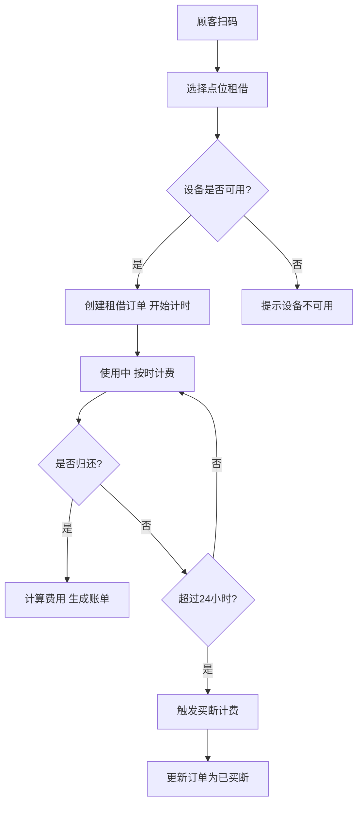
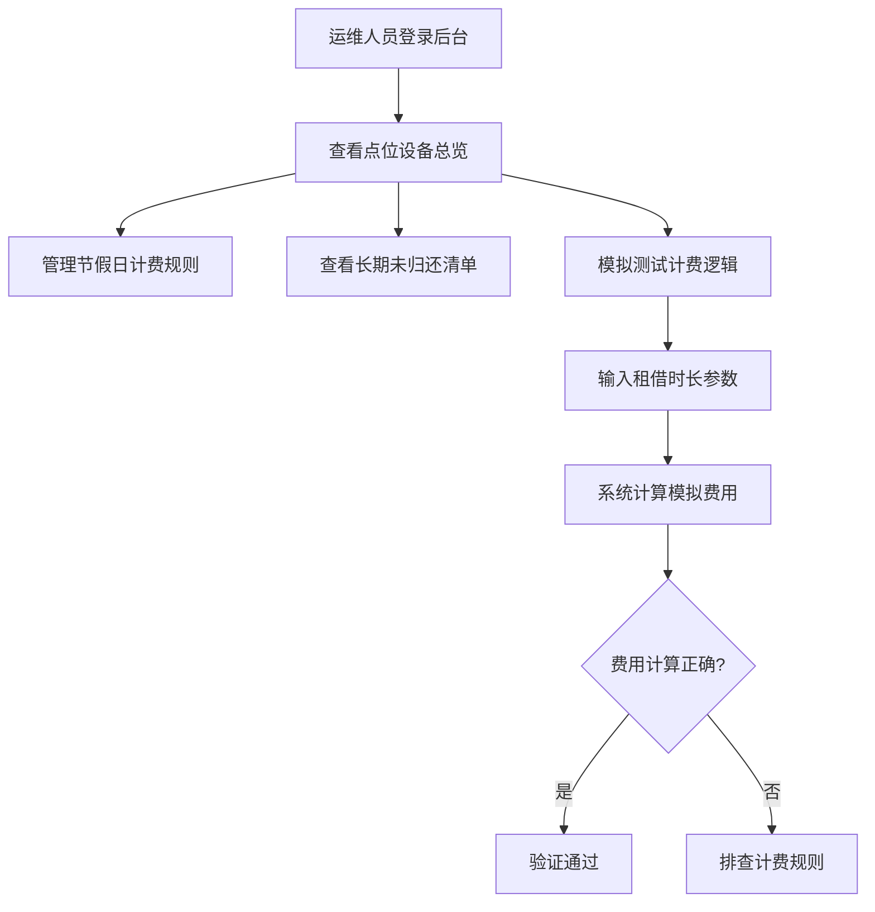

## 1. 产品概述

城市共享充电宝点位租借归还计费系统，面向城市共享充电宝运营场景，实现设备租借、按时计费、超时买断、点位管理的完整业务闭环。系统分为后端计费服务（端口8862）和前端可视化平台（端口3861），分别服务运维人员与租借顾客。

- 解决共享充电宝租借计费流程中设备占用、费用计算、超时买断等核心问题
- 面向运维人员提供点位监控与定价管理能力，面向顾客提供扫码租借与归还体验

## 2. 核心功能

### 2.1 用户角色

| 角色 | 使用方式 | 核心权限 |
|------|----------|----------|
| 顾客 | 扫码进入 | 查看就近点位、租借充电宝、归还充电宝、查看租借记录与费用 |
| 运维人员 | 后台登录 | 查看各点位设备状态、管理节假日计费规则、查看长期未归还清单、模拟测试计费逻辑 |

### 2.2 功能模块

1. **顾客端页面**：点位地图与列表、扫码租借、归还操作、租借记录与费用明细
2. **运维后台页面**：点位设备总览、长期未归还设备清单、节假日计费规则管理、计费模拟测试

### 2.3 页面详情

| 页面名称 | 模块名称 | 功能描述 |
|----------|----------|----------|
| 顾客端-点位选择 | 点位地图/列表 | 展示附近所有点位，标注可用充电宝数量，支持按距离排序 |
| 顾客端-租借操作 | 租借确认 | 选择点位后确认租借，显示预计费率与计费规则，提交租借请求 |
| 顾客端-我的租借 | 租借状态 | 显示当前进行中的租借、实时费用累计、归还按钮、历史租借记录 |
| 运维后台-点位总览 | 设备状态看板 | 各点位总数量/可用数量/已借出/离线状态一览，支持搜索筛选 |
| 运维后台-未归还清单 | 长期未归还列表 | 超过24小时未归还设备清单，显示用户、租借时长、当前费用，支持标记处理 |
| 运维后台-计费规则 | 节假日定价管理 | 新增/编辑/删除节假日上浮规则，设置日期范围与上浮比例 |
| 运维后台-计费模拟 | 模拟测试工具 | 输入租借时长、是否节假日等参数，模拟计算费用，验证买断触发逻辑 |

## 3. 核心流程

### 租借流程
顾客扫码 → 选择就近点位 → 确认租借 → 后端检查设备可用性 → 创建租借订单并开始计时 → 顾客取走充电宝

### 归还流程
顾客选择归还 → 扫描归还点位 → 后端计算费用（基础费率 × 时长 + 节假日上浮） → 停止计时 → 生成账单 → 顾客支付

### 超时买断流程
定时任务检测 → 发现超过24小时未归还 → 自动触发买断计费规则 → 按买断价格计算费用 → 更新订单状态为已买断

## 4. 用户界面设计

### 4.1 设计风格

- **主色调**：深蓝黑 (#0a0e27) 搭配电光绿 (#00e68a) 强调色，体现科技感与能源主题
- **辅助色**：暗灰 (#1a1f3a) 卡片背景、橙色 (#ff6b35) 警告/买断提示
- **按钮风格**：圆角胶囊按钮，主操作电光绿渐变，次要操作半透明描边
- **字体**：标题使用 Orbitron（科技感），正文使用 Noto Sans SC（清晰中文）
- **布局**：左侧导航栏 + 右侧内容区，卡片式模块布局
- **图标风格**：线性图标搭配微光晕效果
- **动画**：数据变化时的数字翻滚效果、状态切换的脉冲光晕动画

### 4.2 页面设计概览

| 页面名称 | 模块名称 | UI 元素 |
|----------|----------|---------|
| 顾客端-点位选择 | 点位地图/列表 | 卡片列表布局，每个点位卡片含电量动态图标、可用数量进度条、距离标签、渐变背景 |
| 顾客端-租借操作 | 租借确认 | 居中弹窗，充电宝3D图标脉冲动画，费率信息卡片，胶囊租借按钮带光晕 |
| 顾客端-我的租借 | 租借状态 | 时间线布局，进行中租借大卡片实时费用翻滚、倒计时，历史记录折叠列表 |
| 运维后台-点位总览 | 设备状态看板 | 顶部统计卡片行（总数/可用/借出/离线），下方点位表格带状态标签徽章 |
| 运维后台-未归还清单 | 长期未归还列表 | 表格布局，橙红警告色高亮超时行，操作列带处理按钮 |
| 运维后台-计费规则 | 节假日定价管理 | 卡片式规则列表，新增规则弹窗表单，日期范围选择器，上浮比例滑块 |
| 运维后台-计费模拟 | 模拟测试工具 | 参数输入面板（时长/节假日/费率），右侧实时结果面板，买断触发状态指示灯 |

### 4.3 响应式设计

- 桌面端优先设计，适配 1280px+ 屏幕
- 平板端（768px-1279px）侧边栏折叠为汉堡菜单
- 移动端（<768px）顾客端可用，运维后台提示使用桌面端

### 4.4 无3D场景需求

本系统不涉及3D可视化场景。
