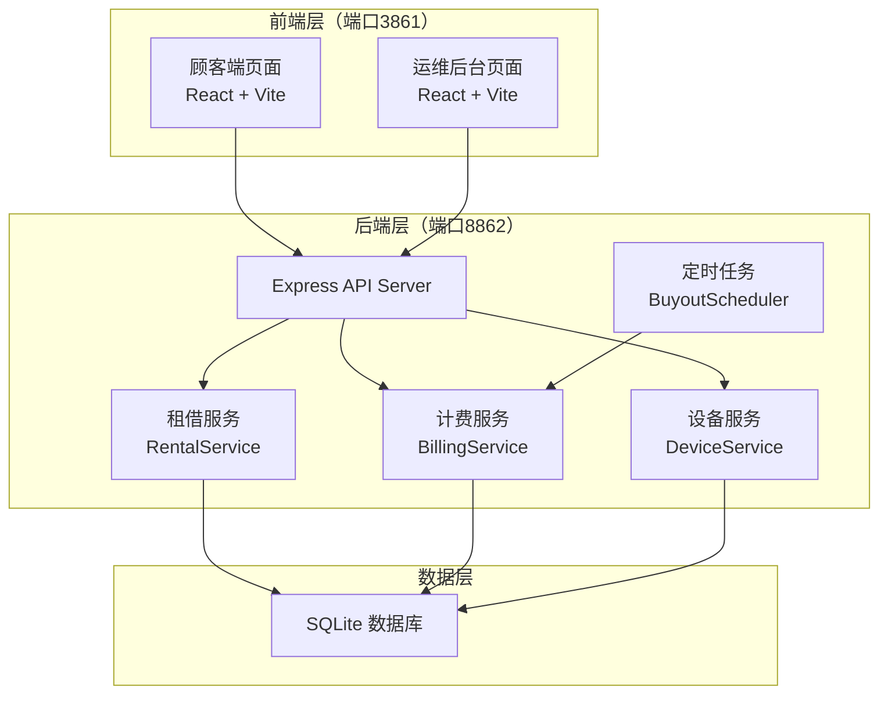
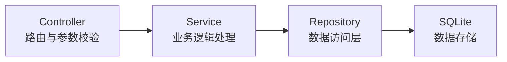
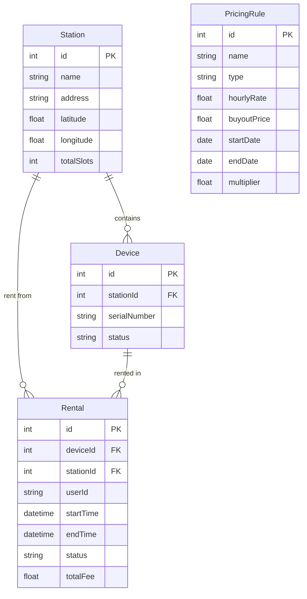

## 1. 架构设计



## 2. 技术说明

- **前端**：React@18 + TailwindCSS@3 + Vite + React Router@6
- **初始化工具**：Vite (create-vite)
- **后端**：Express@4 + better-sqlite3
- **数据库**：SQLite（轻量级，无需额外安装，数据持久化到文件）
- **定时任务**：node-cron 实现超时买断检测
- **端口**：后端 API 8862，前端开发服务器 3861

## 3. 路由定义

### 前端路由

| 路由 | 用途 |
|------|------|
| / | 顾客端 - 点位选择首页 |
| /rent/:stationId | 顾客端 - 租借确认页 |
| /my-rentals | 顾客端 - 我的租借记录 |
| /admin | 运维后台 - 点位设备总览 |
| /admin/unreturned | 运维后台 - 长期未归还清单 |
| /admin/pricing | 运维后台 - 节假日计费规则管理 |
| /admin/simulator | 运维后台 - 计费模拟测试 |

### 后端 API 路由

| 方法 | 路由 | 用途 |
|------|------|------|
| GET | /api/stations | 获取所有点位列表及设备数量 |
| GET | /api/stations/:id | 获取单个点位详情 |
| POST | /api/rentals | 创建租借订单 |
| POST | /api/rentals/:id/return | 归还设备，计算费用 |
| GET | /api/rentals/active | 获取当前进行中的租借 |
| GET | /api/rentals/history | 获取历史租借记录 |
| GET | /api/rentals/unreturned | 获取长期未归还列表 |
| GET | /api/devices/station/:stationId | 获取点位下所有设备 |
| GET | /api/pricing/rules | 获取所有计费规则 |
| POST | /api/pricing/rules | 新增节假日计费规则 |
| PUT | /api/pricing/rules/:id | 更新计费规则 |
| DELETE | /api/pricing/rules/:id | 删除计费规则 |
| POST | /api/pricing/simulate | 计费模拟计算 |

## 4. API 定义

### 数据类型

```typescript
interface Station {
  id: number;
  name: string;
  address: string;
  latitude: number;
  longitude: number;
  totalSlots: number;
}

interface Device {
  id: number;
  stationId: number;
  status: 'available' | 'rented' | 'offline';
  serialNumber: string;
}

interface Rental {
  id: number;
  deviceId: number;
  stationId: number;
  userId: string;
  startTime: string;
  endTime: string | null;
  status: 'active' | 'returned' | 'bought_out';
  totalFee: number | null;
}

interface PricingRule {
  id: number;
  name: string;
  type: 'standard' | 'holiday';
  hourlyRate: number;
  buyoutPrice: number;
  startDate: string | null;
  endDate: string | null;
  multiplier: number;
}

interface SimulateRequest {
  hours: number;
  isHoliday: boolean;
  hourlyRate: number;
  buyoutPrice: number;
  multiplier: number;
}

interface SimulateResponse {
  rentalFee: number;
  buyoutTriggered: boolean;
  finalFee: number;
  breakdown: {
    baseFee: number;
    holidaySurcharge: number;
    totalFee: number;
  };
}
```

### 核心请求/响应

**POST /api/rentals** — 创建租借
- 请求：`{ stationId: number, deviceId: number, userId: string }`
- 成功响应：`{ rental: Rental }`
- 失败响应（设备已被借出）：`{ error: "DEVICE_UNAVAILABLE" }`

**POST /api/rentals/:id/return** — 归还设备
- 请求：`{ returnStationId: number }`
- 成功响应：`{ rental: Rental, fee: number, breakdown: {...} }`

**POST /api/pricing/simulate** — 计费模拟
- 请求：`SimulateRequest`
- 响应：`SimulateResponse`

## 5. 服务端架构图



## 6. 数据模型

### 6.1 数据模型定义



### 6.2 数据定义语言

```sql
CREATE TABLE stations (
  id INTEGER PRIMARY KEY AUTOINCREMENT,
  name TEXT NOT NULL,
  address TEXT NOT NULL,
  latitude REAL NOT NULL,
  longitude REAL NOT NULL,
  totalSlots INTEGER NOT NULL DEFAULT 10
);

CREATE TABLE devices (
  id INTEGER PRIMARY KEY AUTOINCREMENT,
  station_id INTEGER NOT NULL REFERENCES stations(id),
  serial_number TEXT NOT NULL UNIQUE,
  status TEXT NOT NULL DEFAULT 'available' CHECK(status IN ('available', 'rented', 'offline'))
);

CREATE TABLE rentals (
  id INTEGER PRIMARY KEY AUTOINCREMENT,
  device_id INTEGER NOT NULL REFERENCES devices(id),
  station_id INTEGER NOT NULL REFERENCES stations(id),
  user_id TEXT NOT NULL,
  start_time TEXT NOT NULL DEFAULT (datetime('now')),
  end_time TEXT,
  status TEXT NOT NULL DEFAULT 'active' CHECK(status IN ('active', 'returned', 'bought_out')),
  total_fee REAL
);

CREATE TABLE pricing_rules (
  id INTEGER PRIMARY KEY AUTOINCREMENT,
  name TEXT NOT NULL,
  type TEXT NOT NULL DEFAULT 'standard' CHECK(type IN ('standard', 'holiday')),
  hourly_rate REAL NOT NULL DEFAULT 2.0,
  buyout_price REAL NOT NULL DEFAULT 99.0,
  start_date TEXT,
  end_date TEXT,
  multiplier REAL NOT NULL DEFAULT 1.0
);

-- 初始标准计费规则
INSERT INTO pricing_rules (name, type, hourly_rate, buyout_price, multiplier) VALUES ('标准费率', 'standard', 2.0, 99.0, 1.0);

-- 初始点位数据
INSERT INTO stations (name, address, latitude, longitude, totalSlots) VALUES
  ('万达广场A区', '万达广场一楼大厅', 31.2304, 121.4737, 12),
  ('地铁南京东路站', '南京东路地铁站2号口', 31.2354, 121.4857, 8),
  ('星巴克南京路店', '南京东路步行街88号', 31.2360, 121.4820, 6),
  ('肯德基人民广场店', '人民广场地下商城B1', 31.2280, 121.4750, 10),
  ('全家便利店静安寺', '静安寺地铁站1号口', 31.2240, 121.4480, 8);
```
